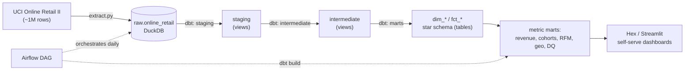
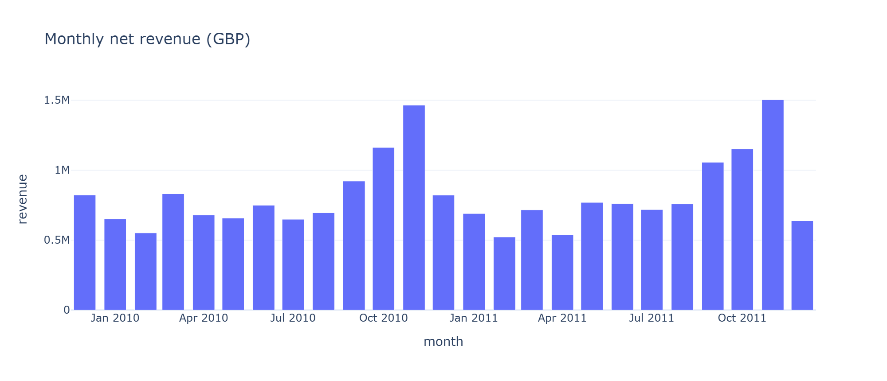
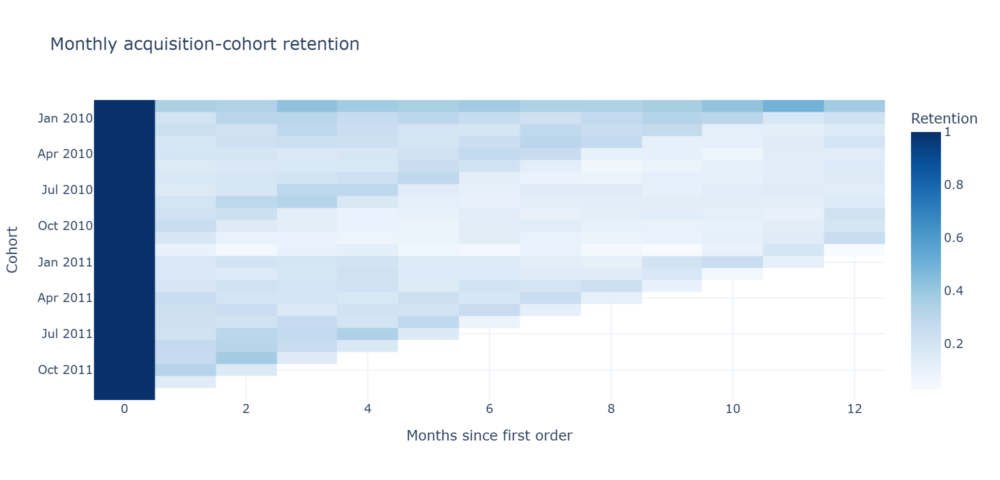
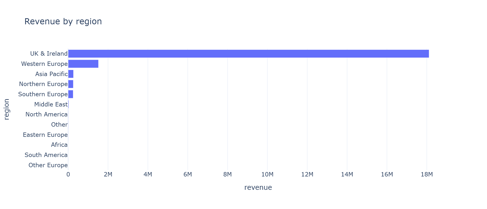
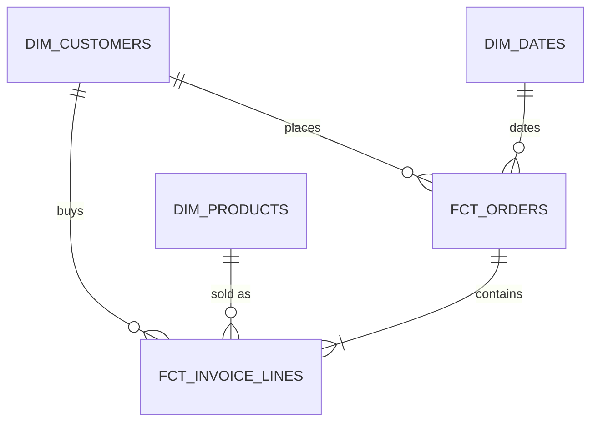

# Retail Analytics Platform

[](https://github.com/brentstorck/retail-analytics-platform/actions/workflows/ci.yml)

End-to-end **analytics engineering** project: raw e-commerce transaction logs become
canonical, tested data models, then company metrics, then self-serve dashboards.

**Stack:** Python (ETL) · DuckDB (warehouse) · **dbt** (transform, test, document) ·
**Airflow** (orchestration) · **Hex** (BI / self-serve) · GitHub Actions (CI).
**Data:** [UCI Online Retail II](https://archive.ics.uci.edu/dataset/502/online+retail+ii),
about 1M real UK online-retail transactions from 2009 to 2011 (public, no login).

This project turns raw invoice logs into a star-schema warehouse and a set of marts that
answer the questions a **GTM / Product** analytics team actually asks: how is revenue
trending, are we keeping the customers we acquire, which segments and regions drive growth,
and which products and pipelines are healthy. Data-integrity tests and a freshness SLA run
on every build, and CI runs the whole thing on every push.

## Architecture



Extract and load are plain Python (the EL of ELT); all transformation happens in the
warehouse with dbt (the T). DuckDB is the warehouse so the whole thing runs on a laptop
with no cloud account. Moving to Snowflake or BigQuery is a `profiles.yml` change only:
the models, tests, and docs do not change.

## Dashboards

The same marts shown three ways below (regenerate with `python scripts/export_charts.py`,
or run the interactive version with `streamlit run dashboard/app.py`):





## What's in here

| Path                    | What it is                                                          |
|-------------------------|--------------------------------------------------------------------|
| `pipeline/`             | Python extract + load + export (the EL of ELT), no Airflow needed   |
| `retail_dbt/`           | dbt project: sources, staging to marts, tests, unit tests, seeds, docs, exposures |
| `airflow/`              | Airflow DAG + Docker setup that orchestrates the same pipeline      |
| `hex/`                  | Hex dashboard spec and the exact SQL for each chart                 |
| `dashboard/`            | Streamlit app, a local preview of the marts                         |
| `scripts/`              | helper scripts (chart export for the README)                        |
| `tests/`                | pytest unit tests + the small CI data fixture                       |
| `.github/workflows/`    | CI: pytest + full dbt build and tests on every push                 |
| `docs/architecture.md`  | deeper design notes and the metric dictionary                       |
| `CLAUDE.md`             | engineering guide and job-description mapping                       |

## Quickstart (Windows / PowerShell)

```powershell
python -m venv .venv
.\.venv\Scripts\Activate.ps1
pip install -r requirements.txt

# loader and dbt share this warehouse path
$env:DUCKDB_PATH = "$PWD\warehouse\retail.duckdb"

python -m pipeline.run            # extract -> load -> dbt build -> export marts
streamlit run dashboard/app.py    # explore the marts
```

macOS / Linux: use `. .venv/bin/activate` and `export DUCKDB_PATH="$PWD/warehouse/retail.duckdb"`.

Step by step:

```bash
python -m pipeline.extract        # download + cache the dataset (idempotent)
python -m pipeline.load           # load raw .xlsx -> DuckDB raw.online_retail
cd retail_dbt
dbt deps && dbt seed && dbt build  # build models AND run all tests
dbt source freshness               # check the data SLA
dbt docs generate                  # lineage graph + data catalog
```

## Orchestrated run (Airflow)

`airflow/dags/retail_analytics_dag.py` runs the same steps daily with retries and task
SLAs. Airflow does not run natively on Windows, so use the included Docker setup:

```bash
cd airflow
docker compose up -d --build       # UI at http://localhost:8080, trigger "retail_analytics"
```

## The data model (star schema)



The metric marts BI reads, all built and tested by dbt:

| Mart                         | Grain                   | Used for                                  |
|------------------------------|-------------------------|-------------------------------------------|
| `mart_revenue_daily`         | day (gap-filled)        | revenue, orders, AOV, new vs returning    |
| `mart_revenue_monthly`       | month                   | MoM growth, active and new customers      |
| `mart_customer_cohorts`      | cohort month x age      | retention curves / cohort heatmap         |
| `mart_rfm_segments`          | customer                | RFM segmentation (Champions to Lost)      |
| `mart_country_performance`   | country (+ region)      | geo revenue, AOV, share                   |
| `mart_product_performance`   | product                 | top products, revenue, return rate        |
| `mart_data_quality`          | pipeline                | row counts, null %, cancel/return rates   |

Column-level definitions live in the dbt docs (`dbt docs serve`) and `docs/architecture.md`.

## Testing and data integrity

`dbt build` fails the pipeline if any check fails, so bad data never reaches a dashboard.

- **Source freshness** on `raw.online_retail._loaded_at` (warn 36h / error 7d): the data SLA.
- **Data tests** (60+): `unique`, `not_null`, `relationships`, `accepted_values`, and
  `dbt_utils.accepted_range` on keys, foreign keys, and value ranges.
- **dbt unit tests**: validate model logic against mocked inputs (for example, that
  cancelled orders are excluded and new vs returning is computed correctly), independent of
  the live data.
- **Singular tests** enforce cross-model invariants: order revenue reconciles to the sum of
  its line items, no future invoice dates, cohort retention never exceeds 100%.
- **pytest** covers the Python loader's transformation logic.
- **CI** (`.github/workflows/ci.yml`) runs pytest plus the full dbt build and every test on
  a small committed data sample on each push, so the build stays green and reproducible.

## How I would productionize this

This repo is intentionally laptop-runnable; here is what changes for a real deployment, and
why the design already accounts for it:

- **Warehouse:** swap DuckDB for Snowflake or BigQuery. Only `profiles.yml` changes; the
  models, tests, and docs are portable as written.
- **Orchestration:** run Airflow with the LocalExecutor or Celery and a Postgres metadata
  DB instead of the demo standalone. The DAG already keeps logic in importable modules, so
  it does not change.
- **Ingestion at scale:** replace the single-file load with incremental source ingestion;
  `fct_invoice_lines` is already an incremental model to show the pattern.
- **CI/CD on data:** gate pull requests on `dbt build` against a CI warehouse (Slim CI with
  `state:modified` so only changed models rebuild), which the GitHub Actions workflow is the
  foundation for.
- **Observability:** wire the DAG's failure hook and dbt test failures to Slack/PagerDuty,
  and track freshness and test pass rates over time.
- **Governance:** publish the dbt docs and lineage, and use exposures (already defined) so a
  breaking change to a mart is caught before it reaches the dashboard.

## License and attribution

Code: MIT (see `LICENSE`). Data: UCI Machine Learning Repository, Online Retail II
(Chen, 2019), used for educational and portfolio purposes.
